# Домашнее задание к занятию 1 «Введение в Ansible»

## Подготовка к выполнению

1. Установите Ansible версии 2.10 или выше.
2. Создайте свой публичный репозиторий на GitHub с произвольным именем.
3. Скачайте [Playbook](./playbook/) из репозитория с домашним заданием и перенесите его в свой репозиторий.

## Основная часть

1. Попробуйте запустить playbook на окружении из `test.yml`, зафиксируйте значение, которое имеет факт `some_fact` для указанного хоста при выполнении playbook.

* Ответ

    some_fact: 12
    
    ```bash
    ansible-playbook -i inventory/test.yml site.yml
    ```

    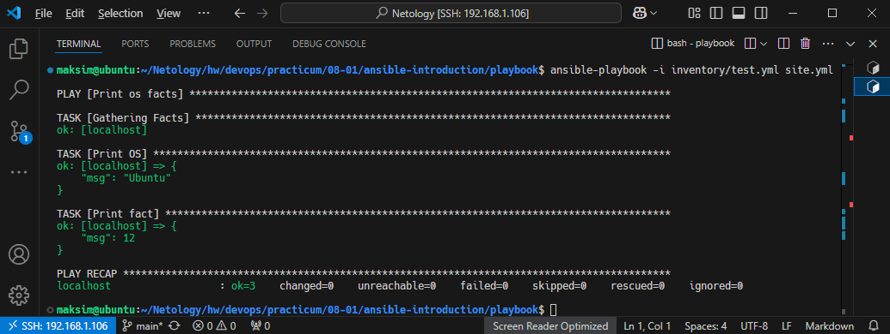


2. Найдите файл с переменными (group_vars), в котором задаётся найденное в первом пункте значение, и поменяйте его на `all default fact`.

* Ответ

    some_fact: "all default fact"
    
    ```bash
    ansible-playbook -i inventory/test.yml site.yml
    ```

    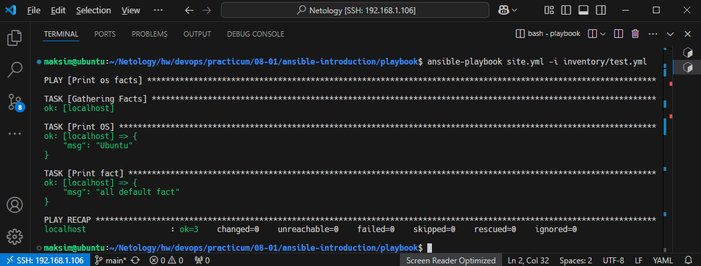

3. Воспользуйтесь подготовленным (используется `docker`) или создайте собственное окружение для проведения дальнейших испытаний.

* Ответ

    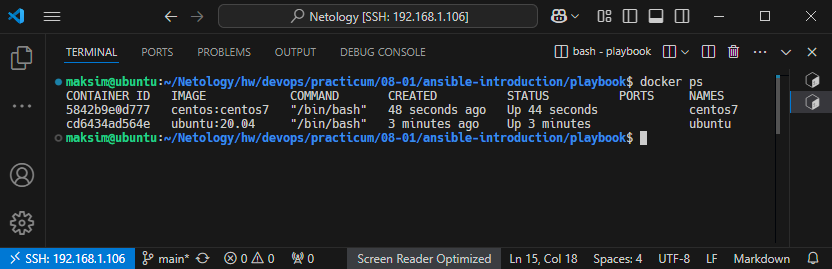

4. Проведите запуск playbook на окружении из `prod.yml`. Зафиксируйте полученные значения `some_fact` для каждого из `managed host`.

* Ответ

    centos7: some_fact: "el"
    
    ubuntu: some_fact: "deb"
    
    ```bash
    ansible-playbook prod.yml -i inventory/test.yml
    ```

    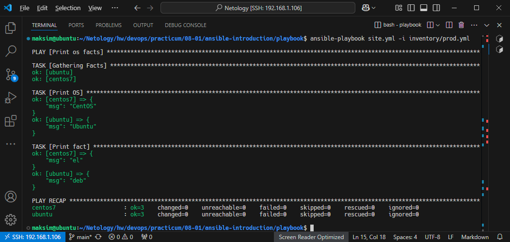

5. Добавьте факты в `group_vars` каждой из групп хостов так, чтобы для `some_fact` получились значения: для `deb` — `deb default fact`, для `el` — `el default fact`.
6.  Повторите запуск playbook на окружении `prod.yml`. Убедитесь, что выдаются корректные значения для всех хостов.

* Ответ

    centos7: some_fact: "el default fact"
    
    ubuntu: some_fact: "deb default fact"
    
    ```bash
    ansible-playbook prod.yml -i inventory/test.yml
    ```

    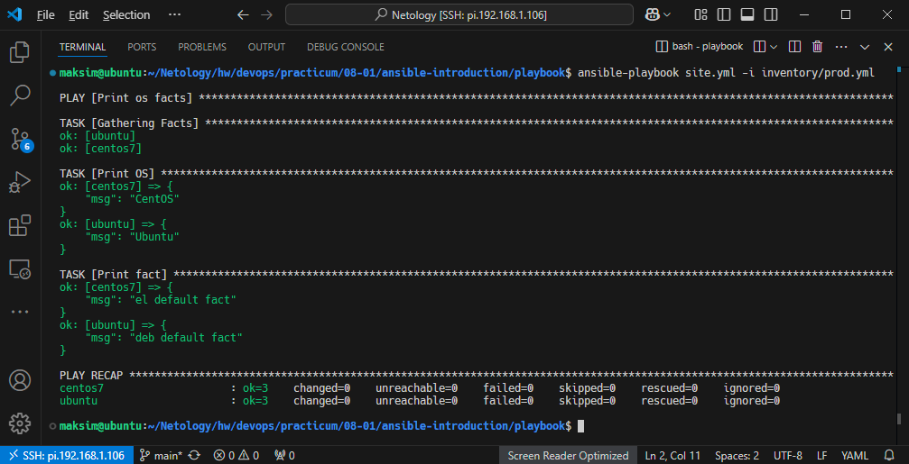

7. При помощи `ansible-vault` зашифруйте факты в `group_vars/deb` и `group_vars/el` с паролем `netology`.

* Ответ
    
    ```bash
    ansible-vault encrypt group_vars/deb/examp.yml
    ansible-vault encrypt group_vars/el/examp.yml
    ```

    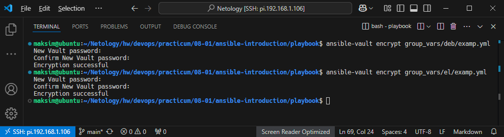

8. Запустите playbook на окружении `prod.yml`. При запуске `ansible` должен запросить у вас пароль. Убедитесь в работоспособности.

* Ответ

    Для того чтобы использовать зашифрованные файлы, команду `ansible-playbook` нужно выполнить с дополнительным ключом `--ask-vault-pass`
    
    ```bash
    ansible-playbook site.yml -i inventory/prod.yml --ask-vault-pass
    ```

    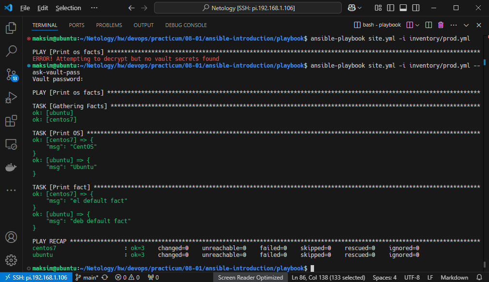

9. Посмотрите при помощи `ansible-doc` список плагинов для подключения. Выберите подходящий для работы на `control node`.

* Ответ
    
    ```bash
    ansible-doc -t connection -l
    ```

    Для работы с хостом с предустановленным Ansible (control node), подойдёт [ansible.builtin.local](https://docs.ansible.com/ansible/latest/collections/ansible/builtin/local_connection.html), первый плагин в списке:

    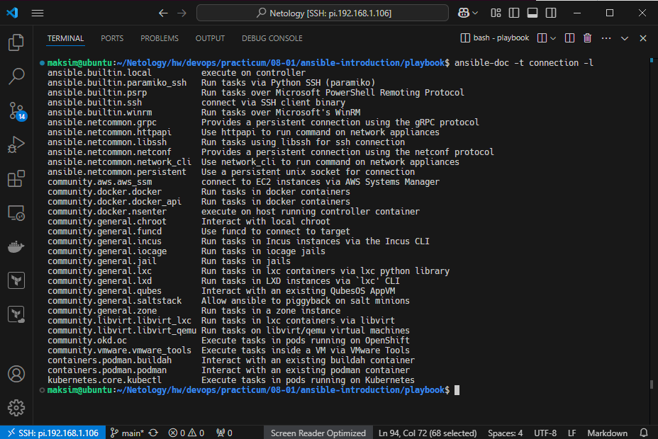


10. В `prod.yml` добавьте новую группу хостов с именем  `local`, в ней разместите localhost с необходимым типом подключения.
11. Запустите playbook на окружении `prod.yml`. При запуске `ansible` должен запросить у вас пароль. Убедитесь, что факты `some_fact` для каждого из хостов определены из верных `group_vars`.

* Ответ
    
    ```bash
    ansible-playbook site.yml -i inventory/prod.yml --ask-vault-pass
    ```

    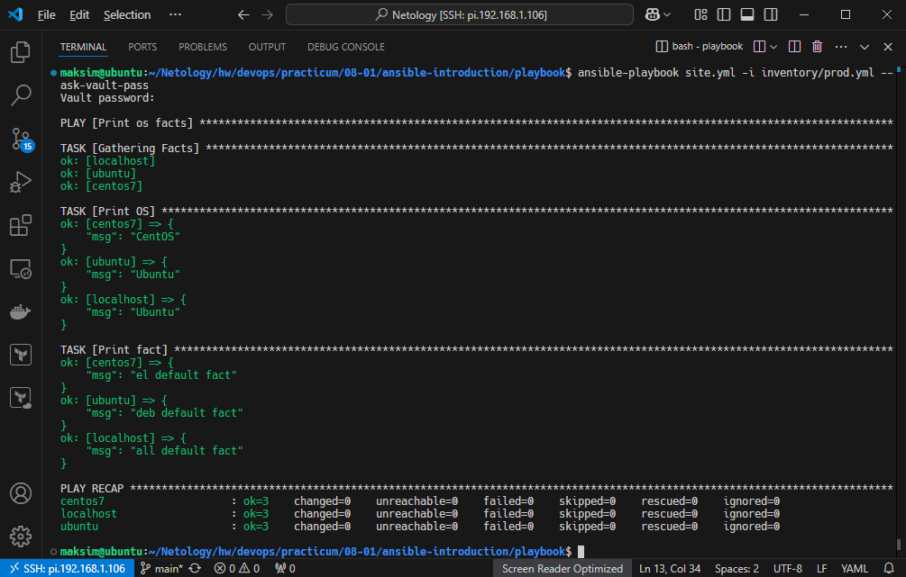

12. Заполните `README.md` ответами на вопросы. Сделайте `git push` в ветку `master`. В ответе отправьте ссылку на ваш открытый репозиторий с изменённым `playbook` и заполненным `README.md`.
13. Предоставьте скриншоты результатов запуска команд.

## Необязательная часть

1. При помощи `ansible-vault` расшифруйте все зашифрованные файлы с переменными.

* Ответ
    
    ```bash
    ansible-vault encrypt_string
    ```

    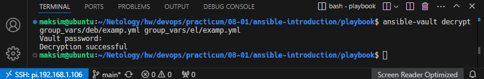

2. Зашифруйте отдельное значение `PaSSw0rd` для переменной `some_fact` паролем `netology`. Добавьте полученное значение в `group_vars/all/exmp.yml`.

* Ответ
    
    ```bash
    ansible-vault encrypt_string
    ```

    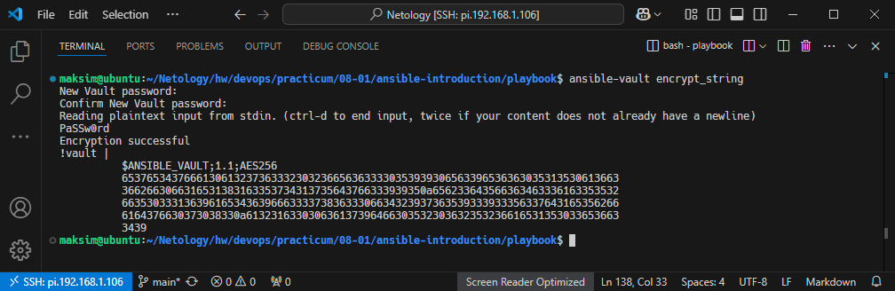

3. Запустите `playbook`, убедитесь, что для нужных хостов применился новый `fact`.

* Ответ
    
    ```bash
    ansible-playbook site.yml -i inventory/prod.yml --ask-vault-pass
    ```

    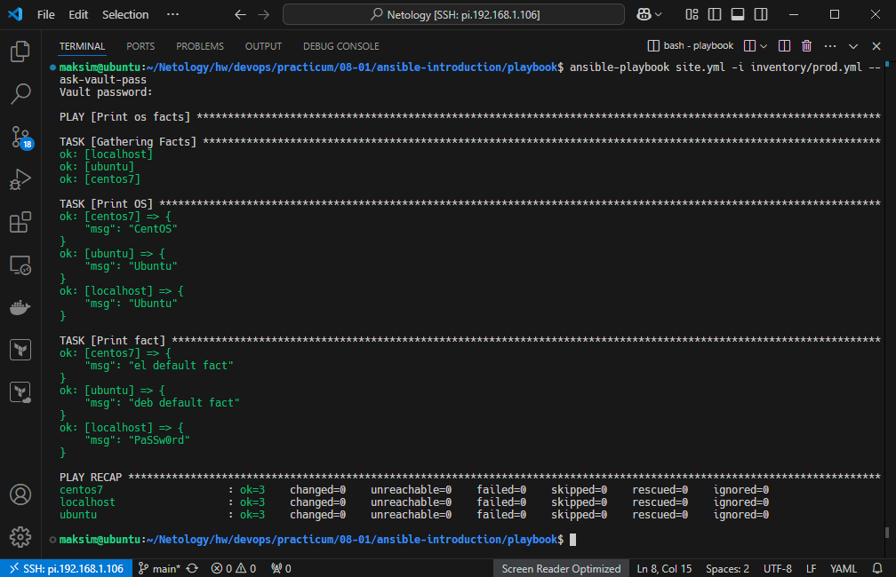

4. Добавьте новую группу хостов `fedora`, самостоятельно придумайте для неё переменную. В качестве образа можно использовать [этот вариант](https://hub.docker.com/r/pycontribs/fedora).

* Ответ

    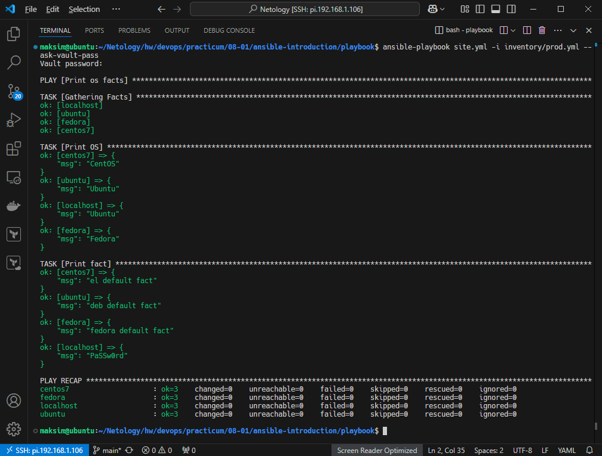

5. Напишите скрипт на bash: автоматизируйте поднятие необходимых контейнеров, запуск ansible-playbook и остановку контейнеров.

* Ответ

    [script.sh](playbook/script.sh)

    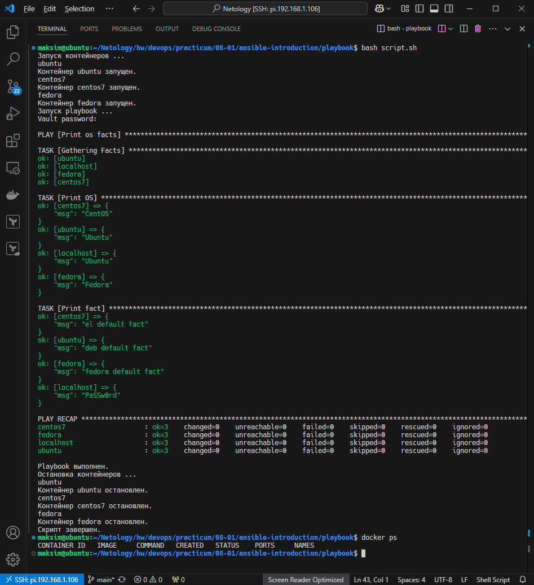

6. Все изменения должны быть зафиксированы и отправлены в ваш личный репозиторий.

---

### Как оформить решение задания

Выполненное домашнее задание пришлите в виде ссылки на .md-файл в вашем репозитории.

---
