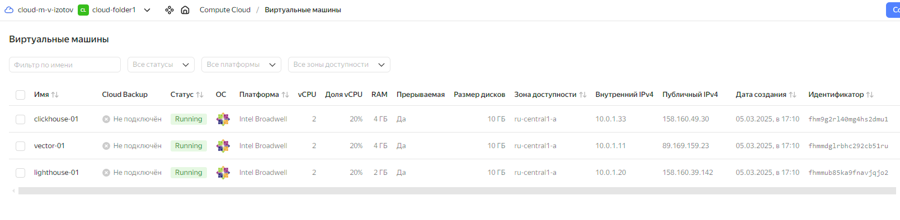
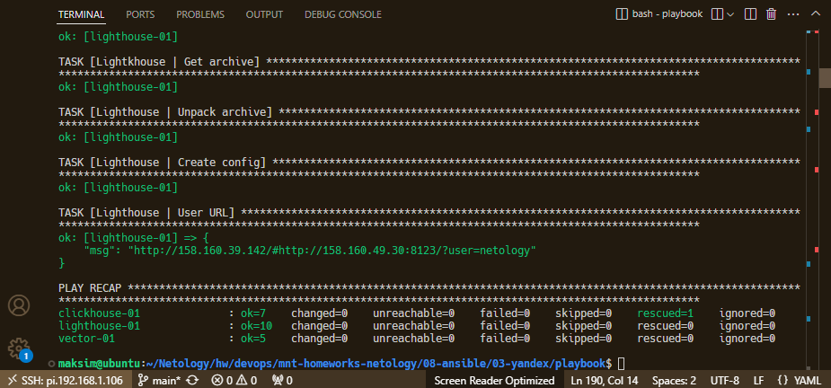
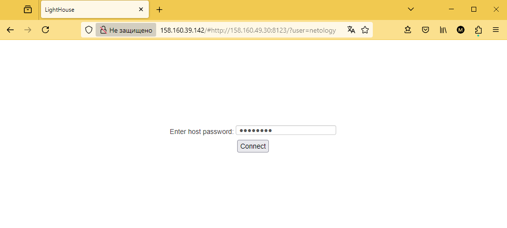
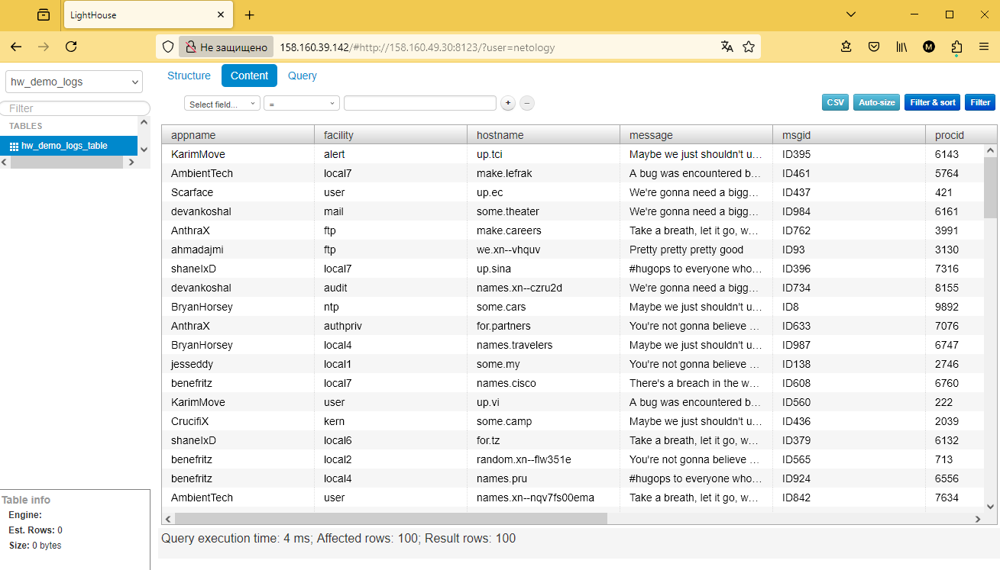

# Домашнее задание к занятию 3 «Использование Ansible»

## Подготовка к выполнению

1. Подготовьте в Yandex Cloud три хоста: для `clickhouse`, для `vector` и для `lighthouse`.
2. Репозиторий LightHouse находится [по ссылке](https://github.com/VKCOM/lighthouse).

## Основная часть

1. Допишите playbook: нужно сделать ещё один play, который устанавливает и настраивает LightHouse.
2. При создании tasks рекомендую использовать модули: `get_url`, `template`, `yum`, `apt`.
3. Tasks должны: скачать статику LightHouse, установить Nginx или любой другой веб-сервер, настроить его конфиг для открытия LightHouse, запустить веб-сервер.
4. Подготовьте свой inventory-файл `prod.yml`.
5. Запустите `ansible-lint site.yml` и исправьте ошибки, если они есть.
6. Попробуйте запустить playbook на этом окружении с флагом `--check`.
7. Запустите playbook на `prod.yml` окружении с флагом `--diff`. Убедитесь, что изменения на системе произведены.
8. Повторно запустите playbook с флагом `--diff` и убедитесь, что playbook идемпотентен.
9. Подготовьте README.md-файл по своему playbook. В нём должно быть описано: что делает playbook, какие у него есть параметры и теги.
10. Готовый playbook выложите в свой репозиторий, поставьте тег `08-ansible-03-yandex` на фиксирующий коммит, в ответ предоставьте ссылку на него.

---

### Как оформить решение задания

Выполненное домашнее задание пришлите в виде ссылки на .md-файл в вашем репозитории.

---

### Ответ

Описание playbook: [playbook/README.md](playbook/README.md)

1. С помощью [Terraform](terraform/) развернуты ВМ: clickhouse-01, lighthouse-01 и vector-01:
    

2. Все таски отработали, playbook идемпотентен:
    

3. В конфигурационные файлы ClickHouse были внесены изменения: 
    * /etc/clickhouse-server/users.xml:
    
        добавлен новый пользователь netology с паролем, доступ пользователю default не ограничен без пароля, настройки прописаны в jinja-шаблоне [clickhouse.users.j2](playbook/templates/clickhouse.users.j2):
        
        пользователь netology, вход осуществляется по URL: http://158.160.39.142/#http://158.160.49.30:8123/?user=netology, как описано в репозитории LightHouse (ссылка в начале ДЗ)
        
    * /etc/clickhouse-server/config.xml:
        
        сервер слушает на всех сетевых адресах IPv4: <listen_host>0.0.0.0</listen_host>

4. Логи генерируются с помощью demo_logs - источник Vector для генерации тестовых логов (https://vector.dev/docs/reference/configuration/sources/demo_logs/). Далее обработанные данные (логи) были отправлены в БД ClickHouse (hw_demo_logs), в таблицу hw_demo_logs_table, результат:

    