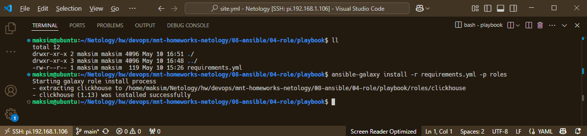
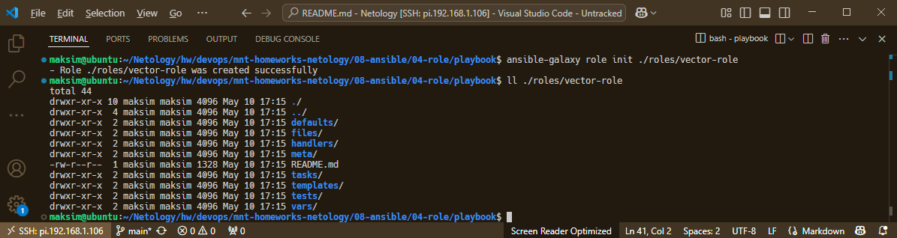

# Домашнее задание к занятию 4 «Работа с roles»

## Подготовка к выполнению

1. * Необязательно. Познакомьтесь с [LightHouse](https://youtu.be/ymlrNlaHzIY?t=929).
2. Создайте два пустых публичных репозитория в любом своём проекте: vector-role и lighthouse-role.
3. Добавьте публичную часть своего ключа к своему профилю на GitHub.

## Основная часть

Ваша цель — разбить ваш playbook на отдельные roles. 

Задача — сделать roles для ClickHouse, Vector и LightHouse и написать playbook для использования этих ролей. 

Ожидаемый результат — существуют три ваших репозитория: два с roles и один с playbook.

**Что нужно сделать**

1. Создайте в старой версии playbook файл `requirements.yml` и заполните его содержимым:

   ```yaml
   ---
     - src: git@github.com:AlexeySetevoi/ansible-clickhouse.git
       scm: git
       version: "1.13"
       name: clickhouse 
   ```

2. При помощи `ansible-galaxy` скачайте себе эту роль.
* **Ответ:**

  * Команда:
    ```bash
    # установка ролей из файла requirements.yml в директорию roles рядом с playbook
    ansible-galaxy install -r requirements.yml -p roles
    ```
  * Выполнение команды: 
      
       
3. Создайте новый каталог с ролью при помощи `ansible-galaxy role init vector-role`.
* **Ответ:**

  * Команда:
    ```bash
    # Создаём новый каталог с ролью и получаем стартовый набор
    ansible-galaxy role init ./roles/vector-role
    ```
  * Выполнение команды: 
      

4. На основе tasks из старого playbook заполните новую role. Разнесите переменные между `vars` и `default`.
* **Ответ:**

  * `vector-role/tasks:` [./playbook/roles/vector-role/tasks/main.yml](./playbook/roles/vector-role/tasks/main.yml)
  * `vector-role/handlers:` [./playbook/roles/vector-role/handlers/main.yml](./playbook/roles/vector-role/handlers/main.yml)
  * `vector-role/vars:` [./playbook/roles/vector-role/vars/main.yml](./playbook/roles/vector-role/vars/main.yml)
  * `vector-role/defaults:` [./playbook/roles/vector-role/defaults/main.yml](./playbook/roles/vector-role/defaults/main.yml)


5. Перенести нужные шаблоны конфигов в `templates`.
* **Ответ:**

  * `vector.yml.j2:` [./playbook/roles/vector-role/templates/vector.yml.j2](./playbook/roles/vector-role/templates/vector.yml.j2)
  * `vector.service.j2:` [./playbook/roles/vector-role/templates/vector.service.j2](./playbook/roles/vector-role/templates/vector.service.j2)


6. Опишите в `README.md` обе роли и их параметры. Пример качественной документации ansible role [по ссылке](https://github.com/cloudalchemy/ansible-prometheus).
* **Ответ:**

  * `vector-role/README.md:` [./playbook/roles/vector-role/README.md](./playbook/roles/vector-role/README.md)
  * `lighthouse-role/README.md:` [./playbook/roles/lighthouse-role/README.md](./playbook/roles/lighthouse-role/README.md)


7. Повторите шаги 3–6 для LightHouse. Помните, что одна роль должна настраивать один продукт.
* **Ответ:**

  * `lighthouse-role/tasks:` [./playbook/roles/lighthouse-role/tasks/main.yml](./playbook/roles/lighthouse-role/tasks/main.yml)
  * `lighthouse-role/handlers:` [./playbook/roles/lighthouse-role/handlers/main.yml](./playbook/roles/lighthouse-role/handlers/main.yml)
  * `lighthouse-role/vars:` [./playbook/roles/lighthouse-role/vars/main.yml](./playbook/roles/lighthouse-role/vars/main.yml)
  * `lighthouse-role/defaults:` [./playbook/roles/lighthouse-role/defaults/main.yml](./playbook/roles/lighthouse-role/defaults/main.yml)
  * `lighthouse.conf.j2:` [./playbook/roles/lighthouse-role/templates/lighthouse.conf.j2](./playbook/roles/lighthouse-role/templates/lighthouse.conf.j2)
  * `nginx.conf.j2:` [./playbook/roles/lighthouse-role/templates/nginx.conf.j2](./playbook/roles/lighthouse-role/templates/nginx.conf.j2)


8. Выложите все roles в репозитории. Проставьте теги, используя семантическую нумерацию. Добавьте roles в `requirements.yml` в playbook.
* **Ответ:**

  * Репозиторий vector-role: https://github.com/maksimVI/vector-role.git
  * Тег v1.0.0: https://github.com/maksimVI/vector-role/releases/tag/v1.0.0
  * Репозиторий lighthouse-role: https://github.com/maksimVI/lighthouse-role.git
  * Тег v1.0.0: https://github.com/maksimVI/lighthouse-role/releases/tag/v1.0.0
  * `requirements.yml:` [./playbook/requirements.yml](./playbook/requirements.yml)


9.  Переработайте playbook на использование roles. Не забудьте про зависимости LightHouse и возможности совмещения `roles` с `tasks`.
* **Ответ:**

  * `site.yml:` [./playbook/site.yml](./playbook/site.yml)


10. Выложите playbook в репозиторий.
11. В ответе дайте ссылки на оба репозитория с roles и одну ссылку на репозиторий с playbook.
* **Ответ:**

  * vector-role: https://github.com/maksimVI/vector-role.git
  * lighthouse-role: https://github.com/maksimVI/lighthouse-role.git
  * playbook: https://github.com/maksimVI/mnt-homeworks-netology/tree/main/08-ansible/04-role/playbook


---

### Как оформить решение задания

Выполненное домашнее задание пришлите в виде ссылки на .md-файл в вашем репозитории.

---
