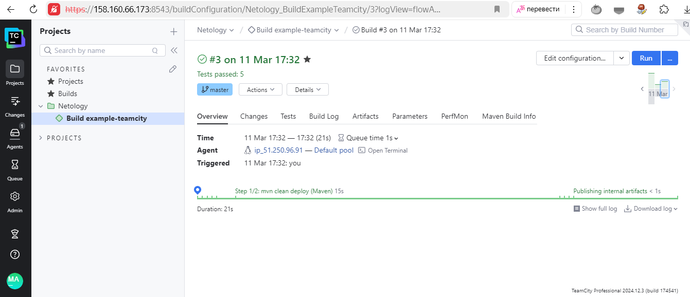

# Домашнее задание к занятию 11 «Teamcity»

## Подготовка к выполнению

1. В Yandex Cloud создайте новый инстанс (4CPU4RAM) на основе образа `jetbrains/teamcity-server`.
2. Дождитесь запуска teamcity, выполните первоначальную настройку.
3. Создайте ещё один инстанс (2CPU4RAM) на основе образа `jetbrains/teamcity-agent`. Пропишите к нему переменную окружения `SERVER_URL: "http://<teamcity_url>:8111"`.
4. Авторизуйте агент.
5. Сделайте fork [репозитория](https://github.com/aragastmatb/example-teamcity).
6. Создайте VM (2CPU4RAM) и запустите [playbook](./infrastructure).

* Ответ

    VM в Yandex Cloud:

    

    Дополнительно настроен https для teamcity-server (https://<teamcity_url>:8543) и оставлен http (http://<teamcity_url>:8111). Сгенерирован файл *.jks. В файле /opt/teamcity/conf/server.xml раскомментированы строки и добавлены параметры: keystoreFile и keystorePass.

    ```xml
    <Connector port="8543" protocol="org.apache.coyote.http11.Http11NioProtocol"
    connectionTimeout="60000"
    useBodyEncodingForURI="true"
    socket.txBufSize="64000"
    socket.rxBufSize="64000"
    SSLEnabled="true"
    scheme="https" secure="true"
    clientAuth="false" sslProtocol="TLS"
    keystoreFile="/opt/teamcity/conf/teamcity.jks" keystorePass="helphelp" />
    ```

## Основная часть

1. Создайте новый проект в teamcity на основе fork.

* Ответ

    Создан проект Netology и сборка Build example-teamcity:

    

2. Сделайте autodetect конфигурации.

* Ответ

    

3. Сохраните необходимые шаги, запустите первую сборку master.

* Ответ

    

4. Поменяйте условия сборки: если сборка по ветке `master`, то должен происходит `mvn clean deploy`, иначе `mvn clean test`.

* Ответ

    

5. Для deploy будет необходимо загрузить [settings.xml](./teamcity/settings.xml) в набор конфигураций maven у teamcity, предварительно записав туда креды для подключения к nexus.

* Ответ

    

6. В pom.xml необходимо поменять ссылки на репозиторий и nexus.

* Ответ

    ```xml
    <repository>
        <id>nexus</id>
        <url>http://158.160.89.231:8081/repository/maven-releases</url>
    </repository>
    ```

7. Запустите сборку по master, убедитесь, что всё прошло успешно и артефакт появился в nexus.

* Ответ

    Запущена сборка по master, всё прошло успешно:

    

    Артефакт появился в nexus:

    

8. Мигрируйте `build configuration` в репозиторий.

* Ответ

    Миграция, успешно:

    

    Репозиторий:

    

9. Создайте отдельную ветку `feature/add_reply` в репозитории.
10. Напишите новый метод для класса Welcomer: метод должен возвращать произвольную реплику, содержащую слово `hunter`.
11. Дополните тест для нового метода на поиск слова `hunter` в новой реплике.
12. Сделайте push всех изменений в новую ветку репозитория.

* Ответ

    

13. Убедитесь, что сборка самостоятельно запустилась, тесты прошли успешно.

* Ответ

    Commit: Added method sayHunter and added Test:

    

    Commit: Change version 0.0.2 Added method sayHunter and added Test:

    

14. Внесите изменения из произвольной ветки `feature/add_reply` в `master` через `Merge`.

* Ответ

    Commit: Merge branch 'feature/add_reply':

    

15. Убедитесь, что нет собранного артефакта в сборке по ветке `master`.

* Ответ

    

16. Настройте конфигурацию так, чтобы она собирала `.jar` в артефакты сборки.

* Ответ

    

17. Проведите повторную сборку мастера, убедитесь, что сбора прошла успешно и артефакты собраны.

* Ответ

    

18. Проверьте, что конфигурация в репозитории содержит все настройки конфигурации из teamcity.
19. В ответе пришлите ссылку на репозиторий.

* Ответ

    https://github.com/maksimVI/example-teamcity

---

### Как оформить решение задания

Выполненное домашнее задание пришлите в виде ссылки на .md-файл в вашем репозитории.

---
