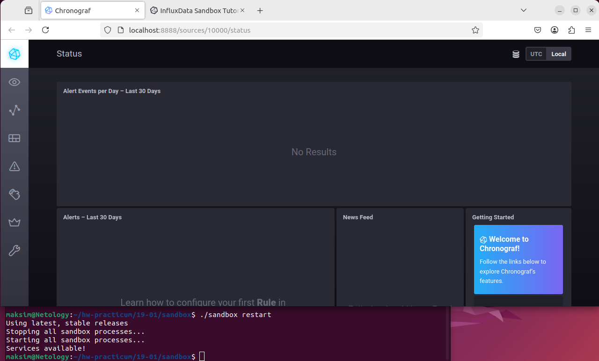
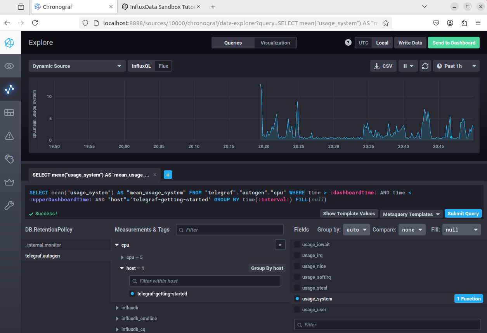
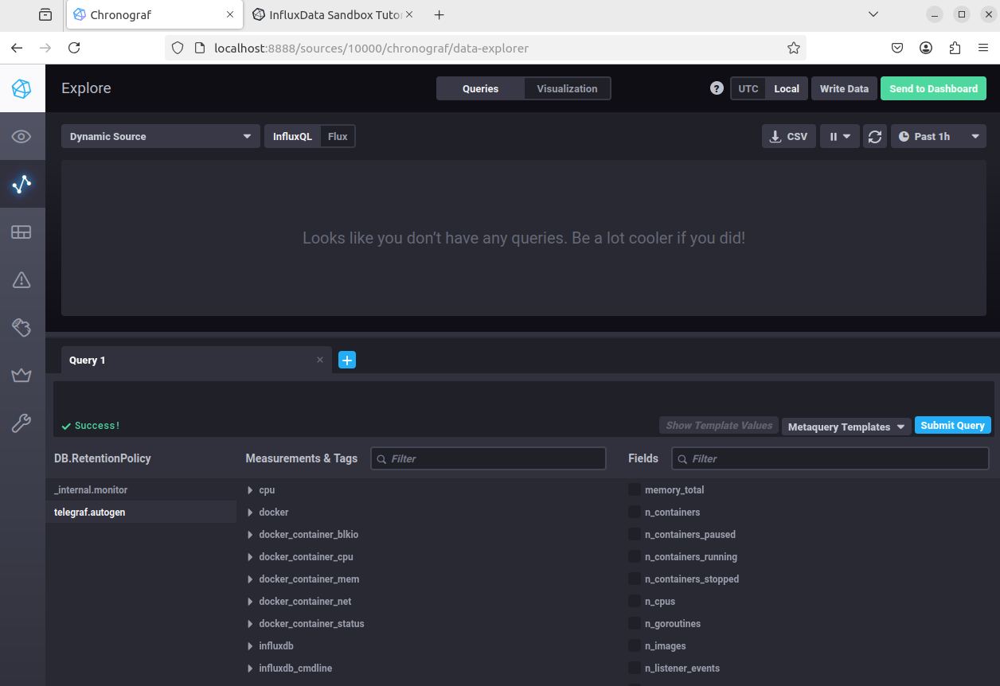

# Домашнее задание к занятию "13.Системы мониторинга"

## Обязательные задания

1. Вас пригласили настроить мониторинг на проект. На онбординге вам рассказали, что проект представляет из себя 
платформу для вычислений с выдачей текстовых отчетов, которые сохраняются на диск. Взаимодействие с платформой 
осуществляется по протоколу http. Также вам отметили, что вычисления загружают ЦПУ. Какой минимальный набор метрик вы
выведите в мониторинг и почему?

### Ответ 1

Дисковое хранилище, т.к. отчеты сохраняются на диск, нужно следить за следующими метриками: 
* Filesystem usage (FS). С помощью метрики FS мы можем следить за свободным местом на диске. Диск заполнится, платформа не сможет сохранять отчеты.
* Input/Output Operations Per Second (IOPS). Метрика IOPS показывает число операций с диском в секунду. Слишком большие значения могут косвенно свидетельствовать о проблемах с дисками. 
* Индексные дескрипторы (inodes). Также очень важно следить за переполнением индексных дескрипторов. Их переполнение делает невозможным создание новых файлов.
Следим за загрузкой CPU, метрики:
* CPU Load Average (CPU LA) - средняя загрузка процессора (1, 5, 15 минут), позволяет получить информацию о нагрузке на центральный процессор. Слишком высокая нагрузка может свидетельствовать о том, что необходимо масштабирование или рефакторинг приложения.
* CPU Utilization (%) - процентное использование процессора, помогает определить, когда вычислительные задачи начинают негативно влиять на производительность.
Следим за использованием RAM. RAM или SWAP позволяет получить информацию об утечках памяти или переполнению контекстов в работе приложений. Нехватка RAM ведёт к замедлению работы, а активное использование SWAP может сигнализировать о проблемах с RAM.

Доступность и время отклика HTTP-сервера, метрики позволяют контролировать доступность сервиса и своевременно обнаруживать аномалии в его работе:
* Среднее время ответа на HTTP-запросы (latency) – показывает, насколько быстро сервер обрабатывает запросы.
* Количество HTTP-запросов в секунду – помогает оценить нагрузку на сервис.
* Количество и частота неуспешно выполненных запросов, например, количество 4xx и 5xx ошибок HTTP-сервера.

#
2. Менеджер продукта посмотрев на ваши метрики сказал, что ему непонятно что такое RAM/inodes/CPUla. Также он сказал, что хочет понимать, насколько мы выполняем свои обязанности перед клиентами и какое качество обслуживания. Что вы можете ему предложить?

### Ответ 2

Технические метрики, такие как CPUla, inodes и RAM, полезны для инженеров, но менеджеру продукта нужны бизнес-ориентированные метрики. Можно предложить SLA/SLO/SLI, "4 золотых сигнала" (время отклика, величина трафика, уровень ошибок, степень загруженности) и удобные дашборды с визуализацией реального качества обслуживания. Это даёт понимание, как сервис работает с точки зрения пользователей и вовремя реагировать на проблемы.

#
3. Вашей DevOps команде в этом году не выделили финансирование на построение системы сбора логов. Разработчики в свою очередь хотят видеть все ошибки, которые выдают их приложения. Какое решение вы можете предпринять в этой ситуации, чтобы разработчики получали ошибки приложения?

### Ответ 3

Исключу прямой доступ к локальным логам, например, через удалённое подключение по SSH или с помощью других инструментов, таких как scp или rsync. 

Предложу более удобную и эффективную систему мониторинга Zabbix. Данная система является бесплатной и не требует покупки дополнительной лицензии. Zabbix предназначен для мониторинга не только метрик приложений, но также сети, серверов и многого другого, предоставляя комплексное решение для управления инфраструктурой. Поддерживает множество методов уведомлений, таких как электронная почта, SMS, мессенджеры (например, через Telegram бота). 

Можно добавить симтему мониторинга Prometheus и использовать вместе с Zabbix, т.к. Prometheus хорошо подходит для контейнеров и микросервисов и гибко работает с Kubernetes, Docker и т.п.

Zabbix по сравнению с Prometheus более простой в установке, так как многие функции уже встроены. Prometheus — это ядро. Всё остальное (визуализация, HA, долговременное хранение, управление пользователями и т.д.) добавляется внешними, тоже бесплатными компонентами: Grafana (визуализация), Alertmanager (алерты), VictoriaMetrics (высокопроизводительное хранилище, совместимое с PromQL) и т.д.

#
4. Вы, как опытный SRE, сделали мониторинг, куда вывели отображения выполнения SLA=99% по http кодам ответов. Вычисляете этот параметр по следующей формуле: summ_2xx_requests/summ_all_requests. Данный параметр не поднимается выше 70%, но при этом в вашей системе нет кодов ответа 5xx и 4xx. Где у вас ошибка?

### Ответ 4

В формулу необходимо добавить 3xx коды (коды перенаправления), будет выглядеть так: summ_2xx_requests + summ_3xx_requests / summ_all_requests

#
5. Опишите основные плюсы и минусы pull и push систем мониторинга.

### Ответ 5

Push-модель подразумевает отправку данных с агентов (рабочих машин, с которых собираем мониторинг) в систему мониторинга, через вспомогательные службы или программы (обычно UDP):

Плюсы:

* упрощение репликации данных в разные системы мониторинга или их резервные копии (на клиенте настраивается конечная точка отправки или набор таких точек);
* более гибкая настройка отправки пакетов данных с метриками (на каждом клиенте задаётся объём данных и частота отправки);
* UDP — это менее затратный способ передачи данных, из-за чего может возрасти производительность сбора метрик.

Минусы:

* нет гарантии опроса только тех агентов, которые настроены в системе мониторинга;
* не получится настроить безопасное взаимодействие агентов с сервером через единый Proxy;
* сложнее собирать логи с агентов.

Pull-модель подразумевает последовательный или параллельный сбор системой мониторинга с агентов накопленной информации из вспомогательных служб:

Плюсы:

* легче контролировать подлинность данных (гарантия опроса только тех агентов, которые настроены в системе мониторинга);
* можно настроить единый proxy-server до всех агентов с TLS (таким образом можно разнести систему мониторинга и агенты, с гарантией безопасности их взаимодействия);
* упрощённая отладка получения данных с агентов (так как данные запрашиваются посредством HTTP, можно самостоятельно запрашивать эти данные, используя ПО вне системы мониторинга).

Минусы:

* сложно организовать репликацию данных между разными системами мониторинга или их резервными копиями;
* менее гибкая настройка отправки пакетов данных с метриками;
* сетевое взаимодействие по протоколу TCP: надёжно, но не так быстро.

#
6. Какие из ниже перечисленных систем относятся к push модели, а какие к pull? А может есть гибридные?

    - Prometheus 
    - TICK
    - Zabbix
    - VictoriaMetrics
    - Nagios

### Ответ 6

    - Prometheus: pull (основная) либо push через Pushgateway (используется редко).
    - TICK: push.
    - Zabbix: push (через агента), так и pull (через SNMP, HTTP и т.п.). Гибридная модель.
    - VictoriaMetrics: push или pull, зависит от источника. Гибридная модель.
    - Nagios: pull (считается гибридом, но с перекосом в pull)

#
7. Склонируйте себе [репозиторий](https://github.com/influxdata/sandbox/tree/master) и запустите TICK-стэк, 
используя технологии docker и docker-compose.

В виде решения на это упражнение приведите скриншот веб-интерфейса ПО chronograf (`http://localhost:8888`). 

P.S.: если при запуске некоторые контейнеры будут падать с ошибкой - проставьте им режим `Z`, например
`./data:/var/lib:Z`

### Ответ 7



#
8. Перейдите в веб-интерфейс Chronograf (http://localhost:8888) и откройте вкладку Data explorer.
        
    - Нажмите на кнопку Add a query
    - Изучите вывод интерфейса и выберите БД telegraf.autogen
    - В `measurments` выберите cpu->host->telegraf-getting-started, а в `fields` выберите usage_system. Внизу появится график утилизации cpu.
    - Вверху вы можете увидеть запрос, аналогичный SQL-синтаксису. Поэкспериментируйте с запросом, попробуйте изменить группировку и интервал наблюдений.

Для выполнения задания приведите скриншот с отображением метрик утилизации cpu из веб-интерфейса.

### Ответ 8



#
9. Изучите список [telegraf inputs](https://github.com/influxdata/telegraf/tree/master/plugins/inputs). 
Добавьте в конфигурацию telegraf следующий плагин - [docker](https://github.com/influxdata/telegraf/tree/master/plugins/inputs/docker):
```
[[inputs.docker]]
  endpoint = "unix:///var/run/docker.sock"
```

Дополнительно вам может потребоваться донастройка контейнера telegraf в `docker-compose.yml` дополнительного volume и 
режима privileged:
```
  telegraf:
    image: telegraf:1.4.0
    privileged: true
    volumes:
      - ./etc/telegraf.conf:/etc/telegraf/telegraf.conf:Z
      - /var/run/docker.sock:/var/run/docker.sock:Z
    links:
      - influxdb
    ports:
      - "8092:8092/udp"
      - "8094:8094"
      - "8125:8125/udp"
```

После настройке перезапустите telegraf, обновите веб интерфейс и приведите скриншотом список `measurments` в 
веб-интерфейсе базы telegraf.autogen . Там должны появиться метрики, связанные с docker.

### Ответ 9.1



Факультативно можете изучить какие метрики собирает telegraf после выполнения данного задания.

### Ответ 9.2


## Дополнительное задание (со звездочкой*) - необязательно к выполнению

1. Вы устроились на работу в стартап. На данный момент у вас нет возможности развернуть полноценную систему 
мониторинга, и вы решили самостоятельно написать простой python3-скрипт для сбора основных метрик сервера. Вы, как 
опытный системный-администратор, знаете, что системная информация сервера лежит в директории `/proc`. 
Также, вы знаете, что в системе Linux есть  планировщик задач cron, который может запускать задачи по расписанию.

Суммировав все, вы спроектировали приложение, которое:
- является python3 скриптом
- собирает метрики из папки `/proc`
- складывает метрики в файл 'YY-MM-DD-awesome-monitoring.log' в директорию /var/log 
(YY - год, MM - месяц, DD - день)
- каждый сбор метрик складывается в виде json-строки, в виде:
  + timestamp (временная метка, int, unixtimestamp)
  + metric_1 (метрика 1)
  + metric_2 (метрика 2)
  
     ...
     
  + metric_N (метрика N)
  
- сбор метрик происходит каждую 1 минуту по cron-расписанию

Для успешного выполнения задания нужно привести:

а) работающий код python3-скрипта,

б) конфигурацию cron-расписания,

в) пример верно сформированного 'YY-MM-DD-awesome-monitoring.log', имеющий не менее 5 записей,

P.S.: количество собираемых метрик должно быть не менее 4-х.
P.P.S.: по желанию можно себя не ограничивать только сбором метрик из `/proc`.

2. В веб-интерфейсе откройте вкладку `Dashboards`. Попробуйте создать свой dashboard с отображением:

    - утилизации ЦПУ
    - количества использованного RAM
    - утилизации пространства на дисках
    - количество поднятых контейнеров
    - аптайм
    - ...
    - фантазируйте)
    
    ---

### Как оформить ДЗ?

Выполненное домашнее задание пришлите ссылкой на .md-файл в вашем репозитории.

---

